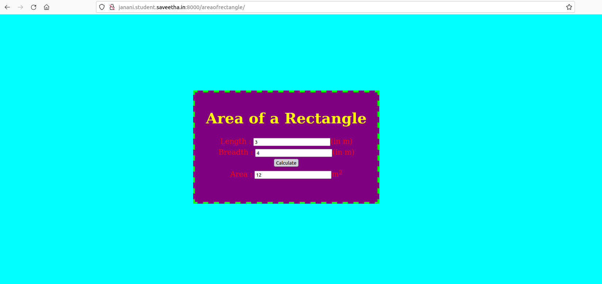

# Design a Website for Server Side Processing

## AIM:
To design a website to perform mathematical calculations in server side.

## DESIGN STEPS:

### Step 1:
Create a folder named ex05.Clone your git repository "serversideprocessing" into it.
### Step 2:
Change your directory into serversideprocessing.Create myapp inside it.
### Step 3:
Make necessary changes in settings.py,urls.py and views.py.
### Step 4:
Create a folder named "templates" and inside the folder create another folder named myapp.
### Step 5:
Create a file inside myapp named "math.html" and write the code for website inside it. Run the server by giving the command "python3 manage.py runserver 0:8000".
### Step 6:
Publish the website in the given URL.
## PROGRAM :
```
<html>
<head>
<meta charset='utf-8'>
<meta http-equiv='X-UA-Compatible' content='IE=edge'>
<title>Area of Rectangle</title>
<meta name='viewport' content='width=device-width, initial-scale=1'>
<style type="text/css">
body 
{
background-color:cyan;
}
.edge {
width: 1080px;
margin-left: auto;
margin-right: auto;
padding-top: 200px;
padding-left: 300px;
}
.box {
display:block;
border: Thick dashed lime;
width: 500px;
min-height: 300px;
font-size: 20px;
background-color: purple;
}
.formelt{
color: Red;
text-align: center;
margin-top: 5px;
margin-bottom: 5px;
}
h1
{
color: yellow;
text-align: center;
padding-top: 20px;
}
</style>
</head>
<body>
<div class="edge">
<div class="box">
<h1>Area of a Rectangle</h1>
<form method="POST">

<div class="formelt">
Length : <input type="text" name="length" value="{{l}}"></input>(in m)<br/>
</div>
<div class="formelt">
Breadth : <input type="text" name="breadth" value="{{b}}"></input>(in m)<br/>
</div>
<div class="formelt">
<input type="submit" value="Calculate"></input><br/>
</div>
<div class="formelt">
Area : <input type="text" name="area" value="{{area}}"></input>m<sup>2</sup><br/>
</div>
</form>
</div>
</div>
</body>
</html>
```
## OUTPUT:

### Home Page:


## Result:
Thus a website to perform mathematical calculations in server side is designed.
